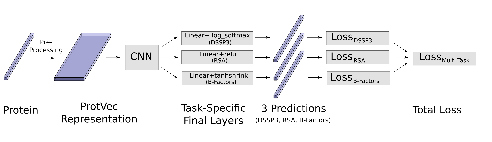
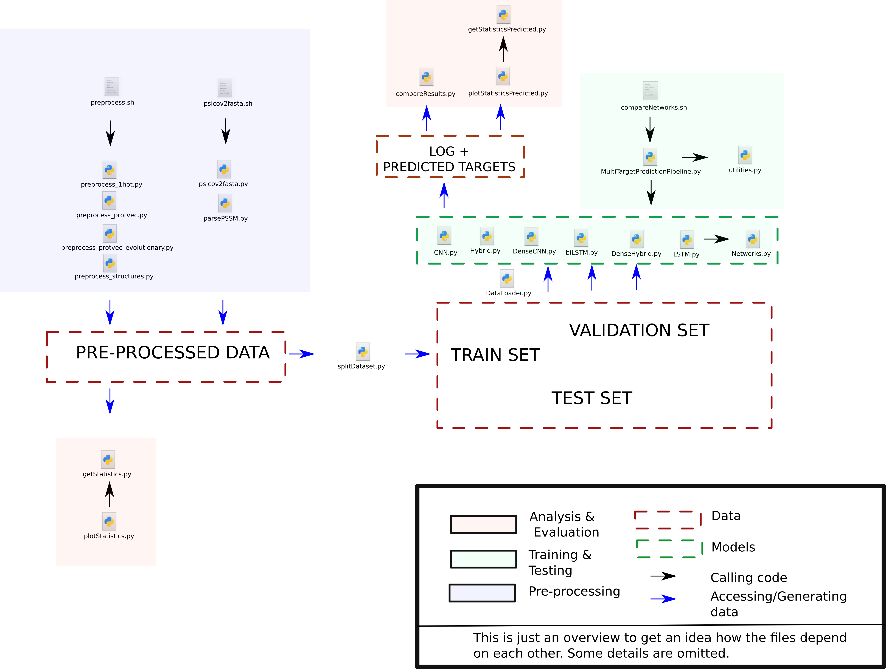

# Combining Word Embeddings Of Protein Sequences With Evolutionary Information For Secondary Structure Prediction Using Deep Neural Networks

##### Abstract: 
The identification of the three-dimensional structure of a protein is fundamental since 
it determines the protein’s function. In bioinformatics, neural networks have proven
to be useful for the prediction of the secondary structure from the linear amino acid
sequence. Here, evolutionary information of the protein is crucial, which is given by
a multiple sequence alignment (MSA). However, the complexity of computing such
MSAs poses a challenge, which is further intensified by the continuing growth of
sequence databases. Hence, a method which does not rely on the computation of MSAs
is desirable. Word embeddings, which in natural language processing represent similar
words by similar vectors, could serve as such an alternative. ProtVec embeddings [1]
have been trained on the SwissProt database and encode combinations of amino acids
as vectors. These implicitly hold evolutionary information since amino acids with
similar biochemical properties are represented by similar vectors.
In this thesis, it is investigated to what extent the use of ProtVec embeddings can
improve the performance of deep neural networks in secondary structure prediction.
Moreover, it will be studied if the prediction can benefit from the additional learning
of structural features, namely the relative solvent accessibility and the flexibility. To
this end, six different network architectures are trained on a data set of 2935 protein
sequences and the resulting predictions are then evaluated. Apart from one convolu-
tional neural networks (CNN), two long short-term memory networks (LSTMs), one
combination of the two network types and two networks with DenseNet-inspired layers
are employed.
The experiments show that the simple encoding of an amino acid sequence through
ProtVec embeddings does not improve the prediction accuracy. However, the employed
DenseHybrid architecture reaches a Q3 accuracy of 83.17% when a combination of
the position-specific scoring matrix and the ProtVec encoded MSA were used as the
input. Finally, the results show that the learning of additional structural features is
possible without a significant loss of performance.

